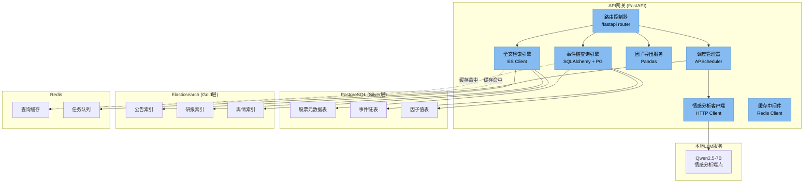

# C4 Level 3 — 组件

> 本文档分解**API网关**容器（系统最复杂的对外服务层），展示其内部组件结构。

## 组件清单

| 组件 | 职责 | 技术 |
|------|------|------|
| **路由控制器** | HTTP路由分发、请求验证、权限检查（单用户token） | FastAPI Router |
| **事件链查询引擎** | 按股票代码/时间范围查询事件链，关联PG多表 | SQLAlchemy + PG |
| **全文检索引擎** | 全文搜索公告/研报/舆情，支持高亮、分页、过滤 | ES Python Client |
| **因子导出服务** | 导出Gold层因子数据为CSV/JSON，服务ML训练 | Pandas + FastAPI |
| **情感分析客户端** | 调用本地LLM服务获取文本情感因子 | HTTP/gRPC Client |
| **缓存中间件** | 热查询结果缓存，降低PG/ES负载 | Redis Client |
| **调度管理器** | 触发ETL管道、LLM批量分析任务 | APScheduler + Redis |

## 组件图

## 关键API端点

| 端点 | 方法 | 组件 | 说明 |
|------|------|------|------|
| `/api/events/{stock_code}` | GET | 事件链查询引擎 | 获取某股票的事件链时间线 |
| `/api/search` | GET | 全文检索引擎 | 全文搜索公告/研报/舆情 |
| `/api/factors/{stock_code}` | GET | 因子导出服务 | 获取某股票的因子数据 |
| `/api/factors/export` | POST | 因子导出服务 | 批量导出因子为CSV |
| `/api/analyze` | POST | 情感分析客户端 | 提交文本获取情感分析结果 |
| `/api/schedule/run` | POST | 调度管理器 | 手动触发ETL/分析任务 |

## 数据模型映射

| 组件 | 主要表/索引 | 关键字段 |
|------|------------|----------|
| 事件链查询引擎 | `events`, `stocks`, `factors` | `stock_code`, `event_time`, `event_type`, `content_hash` |
| 全文检索引擎 | `announcements`, `reports`, `social_posts` | `title`, `content`, `publish_time`, `sentiment_score` |
| 因子导出服务 | `factor_values` | `stock_code`, `factor_date`, `factor_name`, `factor_value` |

## ADR 映射

| ADR | 影响的组件 |
|-----|-----------|
| ADR-001：三层数据架构 | 事件链查询引擎（Silver）、因子导出服务（Gold） |
| ADR-002：PG+ES组合 | 事件链查询引擎（PG）、全文检索引擎（ES） |
| ADR-004：T+1数据新鲜度 | 调度管理器（批量触发） |
