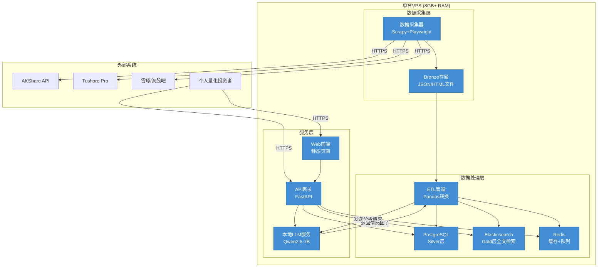

# C4 Level 2 — 容器

## 容器清单

| 容器 | 技术 | 职责 | 内存预算 |
|------|------|------|----------|
| **数据采集器** | Python + Scrapy + Playwright | 从AKShare/Tushare/爬虫源拉取数据，写入Bronze层 | 1GB |
| **Bronze存储** | 本地文件系统 (JSON/HTML) | 存储不可变原始数据，支持审计和重放 | 磁盘I/O |
| **ETL管道** | Python + Pandas | Bronze→Silver→Gold三层转换：去重、清洗、对齐、因子计算 | 1GB |
| **PostgreSQL** | PostgreSQL 15 | Silver层结构化存储：股票元数据、事件链关系、因子值 | 2GB |
| **Elasticsearch** | Elasticsearch 8.x | Gold层全文检索：公告原文、研报、舆情倒排索引 | 2GB |
| **Redis** | Redis 7 | 热查询缓存、任务队列、采集调度 | 1GB |
| **API网关** | FastAPI + Uvicorn | REST接口：事件链查询、全文搜索、因子导出 | 512MB |
| **Web前端** | 静态HTML/JS (可选) | 用户界面：搜索框、事件链时间线、因子可视化 | 256MB |
| **本地LLM服务** | Ollama / llama.cpp (Qwen2.5-7B-GGUF) | 情感分析、因子生成的模型推理服务 | 4GB (GPU) / 6GB (CPU) |

## 容器图

## 数据流说明

1. **采集流**（盘后批量）：数据采集器 → Bronze层（原始JSON/HTML冻结）
2. **ETL流**（T+1处理）：Bronze → ETL清洗 → PostgreSQL（Silver）+ Elasticsearch（Gold）
3. **查询流**（实时）：用户 → API网关 → PostgreSQL（结构化查询）/ Elasticsearch（全文检索）
4. **分析流**（离线批量）：ETL → 本地LLM → 情感因子 → PostgreSQL Gold层

## ADR 映射

| ADR | 影响的容器 |
|-----|-----------|
| ADR-001：三层数据架构 | Bronze存储、ETL管道、PostgreSQL、Elasticsearch |
| ADR-002：PG+ES组合 | PostgreSQL、Elasticsearch |
| ADR-003：个人工具定位 | 所有容器（单用户架构，无多租户） |
| ADR-004：T+1数据新鲜度 | 数据采集器、ETL管道（批量调度） |
