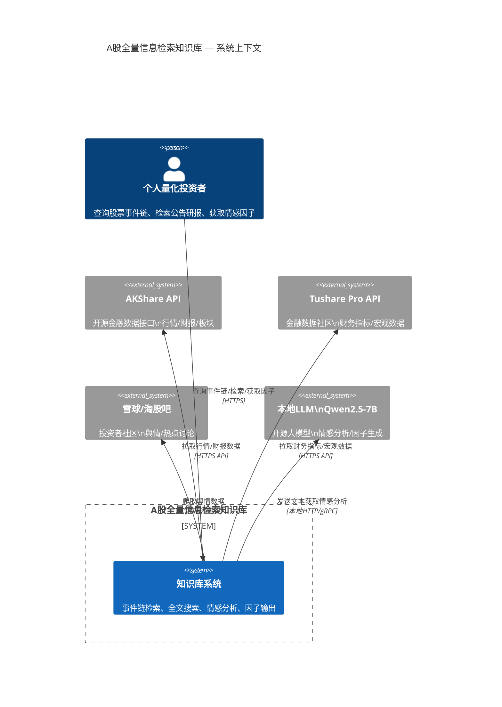

# C4 Level 1 — 系统上下文

## 系统

**A股全量信息检索知识库** — 为个人量化投资者提供基于事件链的A股数据检索、全文搜索和LLM情感分析的单VPS知识库系统。

## 外部角色

| 角色 | 说明 |
|------|------|
| 个人量化投资者 | 系统唯一用户，通过Web界面或API查询股票事件链、全文检索公告/研报、获取LLM情感因子 |
| AKShare API | 开源金融数据接口，提供股票行情、财报等结构化数据 |
| Tushare Pro API | 金融数据社区接口，提供财务指标、宏观数据等 |
| 雪球/淘股吧等网站 | 舆情数据源，通过爬虫获取社区讨论和热点新闻 |
| 本地LLM (Qwen2.5-7B) | 部署在VPS上的开源大模型，用于情感分析和因子生成 |

## 上下文图

## 说明

- 系统边界内为**A股全量信息检索知识库**，部署在单台VPS上
- 系统边界外为**外部依赖**：数据源API、舆情网站、本地LLM
- 用户通过Web界面或REST API与系统交互
- 数据采集为T+1批量模式，非实时流
